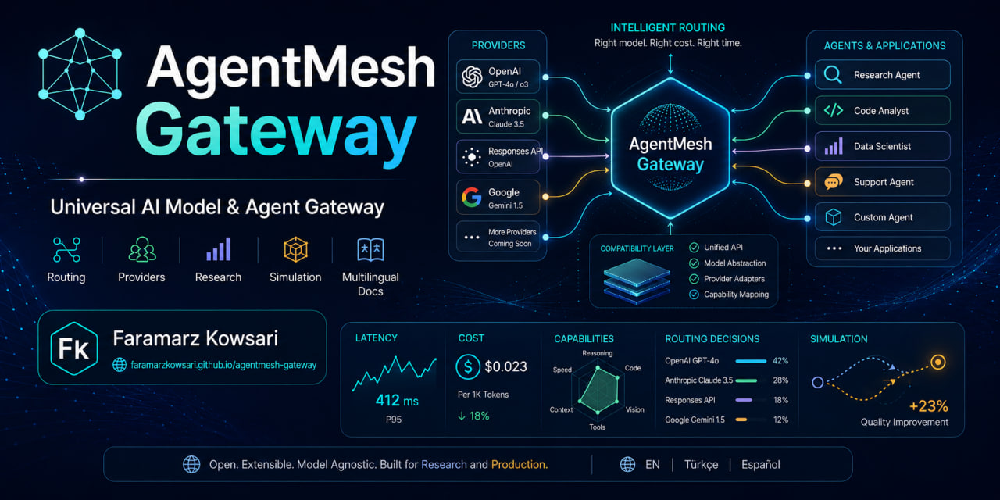

# AgentMesh Gateway

[](https://faramarzkowsari.github.io/agentmesh-gateway/)

[](https://doi.org/10.5281/zenodo.22069468)

**DOI:** [10.5281/zenodo.22069468](https://doi.org/10.5281/zenodo.22069468)

**AgentMesh Gateway** is an independent, protocol-aware gateway for coding agents, AI clients, and model services. It exposes OpenAI Chat Completions-shaped, OpenAI Responses-shaped, and Anthropic Messages-shaped endpoints while routing requests across local and remote providers with explicit feasibility constraints, health-aware fallback, and deterministic policy logic.

The project is an original implementation. It does not copy source code, documentation, assets, internal naming, or commit history from `free-claude-code` or another gateway project. See [PROVENANCE.md](PROVENANCE.md).

## Standalone downloads — no Python required

AgentMesh Gateway v0.3.0 is available as a **single-file standalone executable** for supported desktop platforms. Download the file for your operating system from the [v0.3.0 GitHub Release](https://github.com/FaramarzKowsari/agentmesh-gateway/releases/tag/v0.3.0):

| Platform | Download |
| --- | --- |
| Windows x64 | [`AgentMesh-Gateway-windows-x64.exe`](https://github.com/FaramarzKowsari/agentmesh-gateway/releases/download/v0.3.0/AgentMesh-Gateway-windows-x64.exe) |
| Linux x64 | [`AgentMesh-Gateway-linux-x64`](https://github.com/FaramarzKowsari/agentmesh-gateway/releases/download/v0.3.0/AgentMesh-Gateway-linux-x64) |
| macOS Apple Silicon / ARM64 | [`AgentMesh-Gateway-macos-arm64`](https://github.com/FaramarzKowsari/agentmesh-gateway/releases/download/v0.3.0/AgentMesh-Gateway-macos-arm64) |

Each binary has a matching `.sha256` sidecar in the Release for integrity verification. The release binaries were built on GitHub-hosted Windows, Linux and macOS runners and smoke-tested as frozen executables using both the `version` command and a live `/healthz` request.

Running the standalone binary with no command starts the gateway on `127.0.0.1:8787`; `version` and `simulate` remain available as CLI commands. Python is not required on the target computer. The executable contains the gateway, **not an AI model**: you still need a configured local provider such as Ollama or credentials for a supported remote provider.

The current CI binaries are not commercially code-signed with Windows Authenticode or Apple Developer ID, so Windows SmartScreen or macOS Gatekeeper may show a first-run warning. See [docs/standalone.md](docs/standalone.md) for usage, checksum verification and platform notes.

## v0.3.0 at a glance

v0.3.0 keeps the v0.2 agent-protocol compatibility layer and adds a reproducible adaptive-routing research substrate:

- OpenAI Chat Completions, Responses, and Anthropic Messages-shaped ingress
- generic OpenAI-compatible, Anthropic-compatible, and native Responses-compatible upstream adapters
- custom function-call normalization across the three protocol families
- native preservation for Responses semantics that cannot be translated losslessly
- deterministic Codex custom-provider contract tests for text, function loops, native reasoning, and native tools
- ordered, latency, cost, quality, and balanced production routing policies
- hard feasibility gates for model, circuit state, protocol semantics, declared capabilities, and local quota exhaustion
- explicit provider capabilities: `text`, `tools`, `reasoning`, `native_responses_tools`
- observed-only input/output token accounting and optional USD-per-million token prices
- bounded successful-latency evidence with EWMA, p50, and p95 diagnostics
- deterministic local request-quota windows and quota-pressure diagnostics
- no-network policy simulation with JSON/CSV output
- deterministic semantic task classes: `text`, `tool`, `reasoning`, `native_tool`
- provenance-checked benchmark quality-profile schema
- offline-only `adaptive_balanced` and `constrained_ucb` research policies
- local-first default provider configuration and tests that require no paid API key

The central routing rule is **feasibility before optimization**. A low score can never make an incompatible or exhausted provider eligible.

```text
configured providers
  -> model / circuit constraints
  -> protocol-losslessness constraints
  -> capability constraints
  -> local quota-exhaustion constraint
  -> feasible providers
  -> production static policy OR offline adaptive research policy
```

## Production versus research policies

The live gateway in v0.3.0 supports the same production policy names as before:

- `ordered`
- `latency`
- `cost`
- `quality`
- `balanced`

The adaptive policies are available **only through the offline simulator**:

- `adaptive_balanced`
- `constrained_ucb`

v0.3.0 does not silently enable adaptive production routing and does not claim that either research policy outperforms the static baselines. Performance claims require an actual reproducible experiment.

## Quick start: local Ollama, no paid API key

Requirements: Python 3.11+ and an OpenAI-compatible local server. The default configuration targets Ollama at `http://127.0.0.1:11434/v1` with `qwen2.5-coder:7b`.

```bash
python -m venv .venv
source .venv/bin/activate  # Windows: .venv\\Scripts\\activate
pip install -e '.[dev]'
agentmesh version
agentmesh serve
```

If using Ollama, make sure the configured model exists locally:

```bash
ollama pull qwen2.5-coder:7b
```

The gateway listens on `127.0.0.1:8787` by default.

```bash
curl http://127.0.0.1:8787/healthz
curl http://127.0.0.1:8787/readyz
```

A basic Chat Completions-shaped request:

```bash
curl http://127.0.0.1:8787/v1/chat/completions \
  -H 'Content-Type: application/json' \
  -d '{
    "model": "auto",
    "messages": [{"role": "user", "content": "Write a Python hello world"}]
  }'
```

## Provider configuration

Provider configuration is supplied through `AGENTMESH_PROVIDERS_JSON`. `api_key_env` names an environment variable; secrets are not embedded in provider JSON.

Three adapter types are available:

| Adapter | Upstream wire contract | Primary use |
| --- | --- | --- |
| `openai` | Chat Completions-compatible | local runtimes and generic OpenAI-compatible providers |
| `anthropic` | Anthropic Messages | Anthropic-compatible providers |
| `responses` | OpenAI Responses-compatible | lossless Responses-specific semantics |

Example with capabilities, observed-cost prices, and a local request quota:

```bash
export AGENTMESH_PROVIDERS_JSON='[
  {
    "name": "local",
    "adapter": "openai",
    "base_url": "http://127.0.0.1:11434/v1",
    "models": ["qwen2.5-coder:7b"],
    "capabilities": ["text", "tools"],
    "cost_hint": 0.0,
    "quality_hint": 0.6,
    "input_cost_per_million": 0.0,
    "output_cost_per_million": 0.0,
    "request_quota_limit": 100,
    "request_quota_window_seconds": 60
  },
  {
    "name": "native-responses",
    "adapter": "responses",
    "base_url": "https://api.example.com/v1",
    "api_key_env": "RESPONSES_API_KEY",
    "models": ["model-with-responses-support"],
    "capabilities": ["text", "tools", "reasoning", "native_responses_tools"],
    "cost_hint": 0.5,
    "quality_hint": 0.9
  }
]'
```

### Capability defaults

`capabilities` is optional for backward compatibility. When omitted, adapter-derived defaults are:

| Adapter | Default effective capabilities |
| --- | --- |
| `openai` | `text`, `tools` |
| `anthropic` | `text`, `tools` |
| `responses` | `text`, `tools`, `reasoning`, `native_responses_tools` |

If capabilities are supplied, they are authoritative and may restrict a model below its adapter's defaults.

Vision, audio, and context-window capability routing are intentionally not advertised in v0.3.0 because the normalized request model does not yet represent those dimensions losslessly.

## Observed usage and cost

`cost_hint` remains a static normalized hint used by the existing production `cost` and `balanced` policies. It is **not observed spend**.

Optional `input_cost_per_million` and `output_cost_per_million` fields are USD per one million tokens. AgentMesh computes observed request cost only when exact input/output token counts and both configured prices exist. Missing usage or prices remain missing rather than being estimated or treated as zero.

`/admin/providers` exposes cumulative token/cost observations alongside the configured hints.

## Latency evidence

Successful attempts update the existing latency EWMA and a bounded recent-success window. The control endpoint exposes deterministic nearest-rank p50/p95 values and sample coverage.

Production `latency` and `balanced` routing still use EWMA in v0.3.0. Adding percentile evidence does not silently alter their objective.

## Local request-quota windows

Providers may optionally configure `request_quota_limit` together with `request_quota_window_seconds`. Each outbound provider attempt consumes one local unit, including attempts that later fail. An exhausted provider is removed from the feasible set until the local fixed window resets.

This is a deterministic AgentMesh control model. It does **not** claim to mirror a vendor's private RPM/TPM, billing, or rate-limit counters.

## Responses routing behavior

A Responses request containing only semantics AgentMesh can translate may route to an eligible `openai` or `anthropic` adapter. Custom `function` tools are part of this translated surface.

Requests that carry non-translatable Responses semantics—such as reasoning controls or recognized non-function native tools—require a native `responses` adapter. If no eligible native provider exists, AgentMesh fails explicitly instead of manufacturing equivalent-looking output.

Unknown tool/input types are rejected rather than silently discarded.

## Deterministic policy simulation

The simulator never contacts provider URLs:

```bash
agentmesh simulate \
  --providers examples/simulation/providers.json \
  --trace examples/simulation/trace.jsonl \
  --policies ordered,latency,cost,quality,balanced
```

Adaptive research comparison:

```bash
agentmesh simulate \
  --providers examples/simulation/providers.json \
  --trace examples/simulation/trace.jsonl \
  --quality-profiles examples/simulation/quality-profiles.json \
  --policies balanced,adaptive_balanced,constrained_ucb \
  --format json
```

Each policy starts from fresh deterministic state. Trace outcomes are counterfactual inputs supplied by a test, benchmark procedure, or synthetic fixture; AgentMesh does not fabricate missing provider outcomes.

See [docs/SIMULATION.md](docs/SIMULATION.md).

## Quality profiles and task context

A quality-profile document must include benchmark ID, benchmark version, source, metric, provider/model/task score, and sample count. Scores are contextualized by deterministic request classes:

- `text`
- `tool`
- `reasoning`
- `native_tool`

The classifier uses protocol semantics, not prompt-wording guesses. See [docs/QUALITY_PROFILES.md](docs/QUALITY_PROFILES.md).

The example quality profile in `examples/simulation/` is synthetic mechanics-only data and is not a real benchmark result.

## Codex custom-provider contract

AgentMesh tests a public Codex custom-provider shape using a local deterministic harness:

```toml
model = "m"
model_provider = "agentmesh"

[model_providers.agentmesh]
name = "AgentMesh Gateway"
base_url = "http://127.0.0.1:8787/v1"
wire_api = "responses"
supports_websockets = false
```

The contract suite verifies the HTTP/SSE boundary for tested scenarios. This is intentionally narrower than a claim of complete Codex compatibility. See [docs/CODEX_COMPATIBILITY.md](docs/CODEX_COMPATIBILITY.md).

## Security model

For loopback-only development, authentication is optional. For any non-loopback deployment, configure `AGENTMESH_GATEWAY_TOKEN` and normal network-layer restrictions.

When the token is configured, `/v1/*` and `/admin/providers` require:

```text
Authorization: Bearer <token>
```

`/healthz` and `/readyz` remain unauthenticated for orchestrator probes. Provider credentials remain environment variables.

## Docker

```bash
cp .env.example .env
docker compose up --build
```

The container binds AgentMesh to `0.0.0.0:8787`; publishing that port is network exposure and should be protected accordingly.

## What v0.3.0 does not claim

v0.3.0 does not claim:

- full OpenAI Responses compatibility
- full Codex, Claude Code, Cline, or OpenCode compatibility
- cross-vendor reasoning translation
- cross-vendor translation or local execution of Responses-native built-in tools
- websocket Responses sampling
- image/audio normalization or capability routing
- context-window-aware routing
- exact equivalence between local quota windows and vendor limits
- completeness of provider billing accounting
- live production adaptive/UCB routing
- empirical superiority of adaptive policies

## Development and verification

```bash
ruff check .
pytest
```

CI runs lint and tests on Python 3.11, 3.12, and 3.13. Default contract, simulation, and release-smoke tests require no live provider key.

Engineering guidance: [AGENTS.md](AGENTS.md)  
Architecture: [ARCHITECTURE.md](ARCHITECTURE.md)  
Compatibility boundary: [docs/product-specs/compatibility.md](docs/product-specs/compatibility.md)

## Citation and archival

AgentMesh Gateway is archived through the Zenodo–GitHub integration.

- Repository DOI displayed by Zenodo: `10.5281/zenodo.22069469`
- Archived v0.3.0 DOI used by the official Zenodo badge and `CITATION.cff`: `10.5281/zenodo.22069468`
- Citation metadata: [CITATION.cff](CITATION.cff)
- Citation guidance: [docs/CITATION.md](docs/CITATION.md)

For exact reproducibility of v0.3.0, cite `https://doi.org/10.5281/zenodo.22069468`.

## Release notes and roadmap

- [CHANGELOG.md](CHANGELOG.md)
- [RELEASE_NOTES_v0.3.0.md](RELEASE_NOTES_v0.3.0.md)
- [ROADMAP.md](ROADMAP.md)

## License

Apache License 2.0. See [LICENSE](LICENSE).